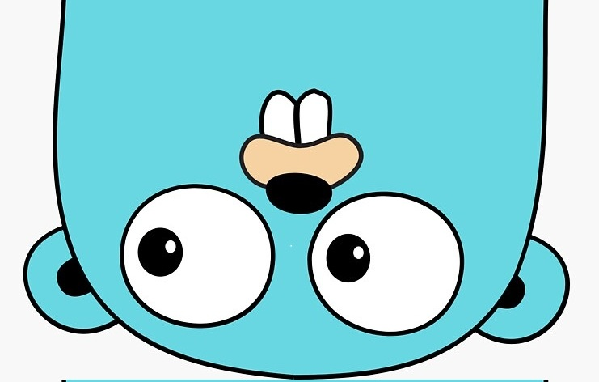

# GOLANG — синтаксис 

  

---

## Темы

- [Примитивные типы данных](01-примитивные-типы-данных)
- [Структурированные типы данных](02-структурированные-типы-данных)
- [Циклы](03-циклы)
- [const / var](04-const-var)
- [Функции](05-функции)
- [Struct](06-struct)
- [Interface](07-interface)

---

⬅️ [На главную](../)
